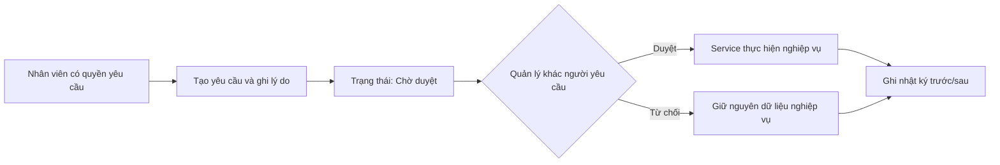

# Phân quyền hệ thống FU Hotel Management

## 1. Mục đích

Tài liệu này thống nhất cách phân quyền cho toàn bộ dự án FU Hotel Management.
Mục tiêu là:

- mỗi nhân viên chỉ thực hiện đúng nghiệp vụ thuộc trách nhiệm của mình;
- không một tài khoản nào tự thực hiện toàn bộ quy trình nghiệp vụ và tự phê duyệt;
- quyền được cấu hình từ cơ sở dữ liệu, không gán cứng vai trò vào từng màn hình hoặc service;
- giao diện ẩn hoặc vô hiệu hóa chức năng không có quyền;
- service luôn kiểm tra lại quyền, kể cả khi người dùng gọi được command bằng cách khác;
- thao tác nhạy cảm có người yêu cầu, người phê duyệt và nhật ký truy vết.

> **Trạng thái cập nhật:** hệ thống đã triển khai quyền động từ cơ sở dữ liệu,
> màn hình cấu hình ma trận quyền, quy trình yêu cầu - phê duyệt và nhật ký cho các
> yêu cầu nhạy cảm. Những mục còn mở được ghi rõ ở phần 10.

## 2. Các loại tài khoản

### 2.1. Tài khoản nhân viên

Hệ thống có 4 vai trò nhân viên:

| Mã vai trò | Tên hiển thị | Trách nhiệm chính |
|---|---|---|
| `Admin` | Quản trị viên | Quản lý tài khoản, vai trò, quyền và an toàn hệ thống |
| `Manager` | Quản lý | Quản lý vận hành, cấu hình nghiệp vụ, báo cáo và phê duyệt |
| `Receptionist` | Lễ tân | Đặt phòng, nhận/trả phòng, khách hàng, hóa đơn và thu tiền |
| `ServiceStaff` | Nhân viên dịch vụ | Tiếp nhận, thực hiện dịch vụ và xử lý yêu cầu buồng phòng |

Mỗi tài khoản nhân viên tại một thời điểm có một vai trò chính. Quyền thực tế của
tài khoản được suy ra từ các quyền đã gán cho vai trò trong cơ sở dữ liệu.

### 2.2. Tài khoản khách

`GuestAccount` là tài khoản dành cho cổng khách hàng, không phải một vai trò nhân
viên trong bảng `Roles`. Tài khoản khách không được truy cập màn hình quản trị nội bộ.

## 3. Nguyên tắc tách nhiệm vụ

### 3.1. Quản trị viên

Quản trị viên chịu trách nhiệm về danh tính và an toàn hệ thống:

- tạo, sửa, khóa và mở khóa tài khoản nhân viên;
- gán vai trò cho nhân viên;
- cấu hình quyền cho từng vai trò;
- xem nhật ký bảo mật và nhật ký phân quyền;
- đặt lại mật khẩu theo quy trình của hệ thống.

Quản trị viên không mặc nhiên làm thay lễ tân, nhân viên dịch vụ hoặc quản lý.
Nếu cần hỗ trợ nghiệp vụ, phải dùng một tài khoản mang vai trò nghiệp vụ phù hợp.

### 3.2. Quản lý

Quản lý chịu trách nhiệm kiểm soát và phê duyệt:

- quản lý phòng, loại phòng, danh mục dịch vụ, phụ thu và khuyến mãi;
- xem báo cáo doanh thu và công suất;
- duyệt giảm giá thủ công;
- duyệt hủy giao dịch thanh toán;
- duyệt hủy hóa đơn theo quy trình;
- theo dõi hoạt động vận hành.

Quản lý không quản trị tài khoản hệ thống và không trực tiếp ghi nhận khoản thanh
toán hằng ngày thay lễ tân.

### 3.3. Lễ tân

Lễ tân thực hiện nghiệp vụ tại quầy:

- tạo, cập nhật và xử lý đặt phòng;
- nhận phòng, gia hạn và trả phòng;
- quản lý thông tin khách hàng;
- lập và tính lại hóa đơn;
- thêm phụ thu phát sinh cho lượt ở;
- ghi nhận thanh toán;
- tạo yêu cầu dịch vụ cho phòng đang ở;
- gửi yêu cầu giảm giá hoặc hủy giao dịch khi cần.

Lễ tân không tự duyệt yêu cầu do chính mình tạo và không được quản lý danh mục
nghiệp vụ hoặc tài khoản nhân viên.

### 3.4. Nhân viên dịch vụ

Nhân viên dịch vụ thực hiện công việc phục vụ:

- xem các đơn dịch vụ cần xử lý;
- nhận việc và cập nhật trạng thái đơn dịch vụ;
- hoàn tất hoặc báo không thể thực hiện đơn;
- xử lý yêu cầu buồng phòng được giao.

Nhân viên dịch vụ không truy cập đặt phòng, thông tin tài chính, báo cáo, khuyến mãi
hoặc quản lý tài khoản.

## 4. Ma trận quyền mục tiêu

Ký hiệu:

- **Có:** được thực hiện trực tiếp;
- **Duyệt:** chỉ được phê duyệt yêu cầu của người khác;
- **Yêu cầu:** được gửi yêu cầu nhưng không tự phê duyệt;
- **Không:** không có quyền.

| Nhóm chức năng | Quyền | Admin | Manager | Receptionist | ServiceStaff |
|---|---|---:|---:|---:|---:|
| Hệ thống | Quản lý tài khoản nhân viên | Có | Không | Không | Không |
| Hệ thống | Gán vai trò và cấu hình quyền | Có | Không | Không | Không |
| Hệ thống | Xem nhật ký bảo mật | Có | Không | Không | Không |
| Phòng | Xem sơ đồ và trạng thái phòng | Không | Có | Có | Có |
| Phòng | Quản lý loại phòng/phòng | Không | Có | Không | Không |
| Phòng | Đưa phòng vào/ngừng bảo trì | Không | Có | Yêu cầu | Yêu cầu |
| Đặt phòng | Xem đặt phòng | Không | Có | Có | Không |
| Đặt phòng | Tạo/cập nhật đặt phòng | Không | Không | Có | Không |
| Đặt phòng | Hủy đặt phòng nhạy cảm | Không | Duyệt | Yêu cầu | Không |
| Lượt ở | Nhận phòng/gia hạn/trả phòng | Không | Không | Có | Không |
| Khách hàng | Xem và cập nhật hồ sơ khách | Không | Không | Có | Không |
| Dịch vụ | Quản lý danh mục dịch vụ | Không | Có | Không | Không |
| Dịch vụ | Tạo đơn dịch vụ cho lượt ở | Không | Không | Có | Không |
| Dịch vụ | Nhận và xử lý đơn dịch vụ | Không | Có | Không | Có |
| Phụ thu | Quản lý danh mục phụ thu | Không | Có | Không | Không |
| Phụ thu | Thêm phụ thu vào lượt ở | Không | Không | Có | Không |
| Khuyến mãi | Quản lý chương trình khuyến mãi | Không | Có | Không | Không |
| Hóa đơn | Xem/lập/tính lại hóa đơn | Không | Có | Có | Không |
| Hóa đơn | Nhập giảm giá thủ công | Không | Duyệt | Yêu cầu | Không |
| Hóa đơn | Hủy hóa đơn | Không | Duyệt | Yêu cầu | Không |
| Thanh toán | Ghi nhận thanh toán | Không | Không | Có | Không |
| Thanh toán | Hủy giao dịch thanh toán | Không | Duyệt | Yêu cầu | Không |
| Báo cáo | Xem và xuất báo cáo | Không | Có | Không | Không |

Ma trận trên là cấu hình mặc định. Khi dự án triển khai phân quyền động, việc thay
đổi quyền phải được thực hiện trên màn hình cấu hình quyền và lưu trong cơ sở dữ liệu,
không sửa điều kiện role trong source.

## 5. Danh mục mã quyền đề xuất

Mã quyền là định danh kỹ thuật ổn định để code gọi kiểm tra. Việc vai trò nào sở hữu
mã quyền nào phải lấy từ cơ sở dữ liệu.

| Module | Mã quyền | Ý nghĩa |
|---|---|---|
| Người dùng | `user.view` | Xem danh sách nhân viên |
| Người dùng | `user.manage` | Tạo, sửa, khóa/mở tài khoản |
| Phân quyền | `permission.manage` | Gán quyền cho vai trò |
| Nhật ký | `audit.view` | Xem nhật ký hệ thống |
| Phòng | `room.view` | Xem phòng và trạng thái |
| Phòng | `room.manage` | Quản lý phòng và loại phòng |
| Phòng | `room.maintenance.request` | Yêu cầu thay đổi trạng thái bảo trì |
| Phòng | `room.maintenance.approve` | Duyệt thay đổi trạng thái bảo trì |
| Đặt phòng | `reservation.view` | Xem đặt phòng |
| Đặt phòng | `reservation.create` | Tạo đặt phòng |
| Đặt phòng | `reservation.update` | Cập nhật đặt phòng |
| Đặt phòng | `reservation.cancel.request` | Yêu cầu hủy đặt phòng |
| Đặt phòng | `reservation.cancel.approve` | Duyệt hủy đặt phòng |
| Lượt ở | `stay.check_in` | Nhận phòng |
| Lượt ở | `stay.extend` | Gia hạn |
| Lượt ở | `stay.check_out` | Trả phòng |
| Khách hàng | `guest.view` | Xem hồ sơ khách |
| Khách hàng | `guest.manage` | Tạo và cập nhật hồ sơ khách |
| Dịch vụ | `service.catalog.manage` | Quản lý danh mục dịch vụ |
| Dịch vụ | `service.order.create` | Tạo đơn dịch vụ |
| Dịch vụ | `service.order.process` | Nhận và xử lý đơn dịch vụ |
| Phụ thu | `surcharge.catalog.manage` | Quản lý danh mục phụ thu |
| Phụ thu | `surcharge.add` | Thêm phụ thu vào lượt ở |
| Khuyến mãi | `promotion.manage` | Quản lý chương trình khuyến mãi |
| Hóa đơn | `invoice.view` | Xem hóa đơn |
| Hóa đơn | `invoice.prepare` | Lập và tính lại hóa đơn |
| Hóa đơn | `invoice.discount.request` | Yêu cầu giảm giá thủ công |
| Hóa đơn | `invoice.discount.approve` | Duyệt giảm giá thủ công |
| Hóa đơn | `invoice.cancel.request` | Yêu cầu hủy hóa đơn |
| Hóa đơn | `invoice.cancel.approve` | Duyệt hủy hóa đơn |
| Thanh toán | `payment.record` | Ghi nhận thanh toán |
| Thanh toán | `payment.void.request` | Yêu cầu hủy giao dịch |
| Thanh toán | `payment.void.approve` | Duyệt hủy giao dịch |
| Báo cáo | `report.view` | Xem báo cáo |
| Báo cáo | `report.export` | Xuất báo cáo |

Không dùng tên hiển thị tiếng Việt làm mã quyền. Không so sánh chuỗi tên vai trò
trong ViewModel hoặc service để quyết định quyền.

## 6. Mô hình dữ liệu đề xuất

### 6.1. `Roles`

| Cột | Ý nghĩa |
|---|---|
| `Id` | Khóa chính |
| `RoleName` | Mã vai trò duy nhất |
| `DisplayName` | Tên hiển thị |
| `Description` | Mô tả trách nhiệm |
| `IsSystemRole` | Vai trò hệ thống cần được bảo vệ |
| `IsActive` | Còn sử dụng hay không |

### 6.2. `Permissions`

| Cột | Ý nghĩa |
|---|---|
| `Id` | Khóa chính |
| `PermissionCode` | Mã quyền duy nhất |
| `DisplayName` | Tên quyền hiển thị |
| `Module` | Nhóm chức năng |
| `Description` | Mô tả quyền |
| `IsActive` | Còn sử dụng hay không |

### 6.3. `RolePermissions`

| Cột | Ý nghĩa |
|---|---|
| `RoleId` | Khóa ngoại tới `Roles` |
| `PermissionId` | Khóa ngoại tới `Permissions` |
| `IsAllowed` | Quyền được bật hay tắt |

Khóa chính ghép là `(RoleId, PermissionId)`. Không lưu danh sách quyền dưới dạng
chuỗi phân cách bằng dấu phẩy.

### 6.4. `ApprovalRequests`

| Cột | Ý nghĩa |
|---|---|
| `Id` | Khóa chính |
| `RequestType` | Loại yêu cầu |
| `TargetType` / `TargetId` | Đối tượng nghiệp vụ cần duyệt |
| `RequestedByUserId` | Người tạo yêu cầu |
| `RequestedAt` | Thời điểm tạo |
| `ReviewedByUserId` | Người duyệt/từ chối |
| `ReviewedAt` | Thời điểm xử lý |
| `Status` | Chờ duyệt, đã duyệt, từ chối, đã hủy |
| `Reason` | Lý do yêu cầu |
| `ReviewNote` | Ý kiến người duyệt |

### 6.5. `AuditLogs`

Nhật ký tối thiểu cần lưu người thực hiện, mã hành động, loại và ID đối tượng,
giá trị trước/sau, thời gian và kết quả. Dữ liệu tài chính không được xóa cứng để
che mất lịch sử.

## 7. Luồng phê duyệt bắt buộc



Các ràng buộc bắt buộc:

1. `RequestedByUserId` phải khác `ReviewedByUserId`.
2. Người ghi nhận thanh toán không được tự duyệt hủy giao dịch đó.
3. Người yêu cầu giảm giá không được tự duyệt yêu cầu của mình.
4. Chỉ yêu cầu ở trạng thái chờ duyệt mới được duyệt hoặc từ chối.
5. Một yêu cầu đã xử lý không được xử lý lần hai.
6. Service phải kiểm tra lại trạng thái đối tượng tại thời điểm duyệt.
7. Hủy hóa đơn có thanh toán phải xử lý các giao dịch liên quan theo đúng quy trình,
   không xóa trực tiếp dữ liệu thanh toán.

## 8. Cách kiểm tra quyền trong source

Hệ thống cần có một dịch vụ phân quyền dùng chung, ví dụ:

```csharp
public interface IAuthorizationService
{
    Task<bool> HasPermissionAsync(string permissionCode);
    Task RequireAsync(string permissionCode);
}
```

Quy trình kiểm tra:

1. Khi đăng nhập, tải vai trò và tập mã quyền đang hoạt động từ cơ sở dữ liệu.
2. Giao diện gọi `HasPermissionAsync(...)` để ẩn hoặc vô hiệu hóa menu, nút và command.
3. Service gọi `RequireAsync(...)` trước khi thay đổi dữ liệu.
4. Không dựa vào việc nút đã bị ẩn để bảo vệ nghiệp vụ.
5. Khi Admin thay đổi cấu hình quyền, phiên đăng nhập phải nạp lại quyền hoặc yêu
   cầu đăng nhập lại.

Mã quyền có thể khai báo bằng hằng số để tránh gõ sai, ví dụ
`PermissionCodes.PaymentRecord`. Đây không phải hard-code phân quyền. Hard-code cần
loại bỏ là kiểu:

```csharp
// Không dùng trong thiết kế mục tiêu
if (AppSession.RoleName is RoleNames.Admin or RoleNames.Manager)
{
    // Cho phép nghiệp vụ
}
```

Ánh xạ `Manager` có `payment.void.approve`, còn `Receptionist` có
`payment.void.request`, phải nằm trong `RolePermissions`.

## 9. Quy tắc giao diện

- Chỉ hiển thị module khi người dùng có ít nhất một quyền xem hoặc thao tác trong module.
- Nút không có quyền phải ẩn; nếu cần giải thích quy trình thì có thể vô hiệu hóa và
  hiển thị tooltip rõ lý do.
- Màn hình duyệt của Manager phải hiển thị người yêu cầu, thời gian, lý do, dữ liệu
  ảnh hưởng và lịch sử liên quan.
- Màn hình cấu hình quyền phải nhóm theo module và cảnh báo khi cấu hình tạo xung đột
  tách nhiệm vụ.
- Thông báo từ chối quyền phải thân thiện, không để lộ thông tin kỹ thuật.

## 10. Trạng thái source hiện tại

Source hiện đã có:

- 4 vai trò và 35 quyền được seed trong cơ sở dữ liệu;
- bảng `Permissions`, `RolePermissions`, `ApprovalRequests` và `AuditLogs`;
- nạp tập quyền của vai trò vào phiên đăng nhập;
- lọc module, nút và command theo mã quyền;
- service kiểm tra lại quyền trước khi thay đổi dữ liệu;
- màn hình cấu hình ma trận quyền cho Admin;
- màn hình phê duyệt cho Manager;
- luồng yêu cầu - phê duyệt cho huỷ đặt phòng, giảm giá, huỷ hoá đơn,
  huỷ thanh toán và yêu cầu bảo trì;
- chặn người yêu cầu tự phê duyệt và chặn cấu hình quyền xung đột;
- test ma trận quyền và tách nhiệm vụ.

Source hiện còn cần thay đổi:

- mở rộng `AuditLogs` sang toàn bộ thao tác CRUD thông thường; hiện nhật ký tập trung
  đã bao phủ quy trình yêu cầu - phê duyệt;
- bổ sung màn hình tra cứu nhật ký cho Admin;
- tiếp tục bổ sung test giao diện tự động nếu dự án chọn framework UI automation.

## 11. Kế hoạch triển khai đề xuất

Mỗi mục hoàn thành phải là một commit riêng:

1. Thêm entity, cấu hình EF, seed và migration cho quyền động.
2. Thêm repository và service tải/kiểm tra quyền.
3. Nạp quyền vào phiên đăng nhập và thay kiểm tra role trong service.
4. Thay kiểm tra role trong ViewModel, sidebar và command.
5. Thêm màn hình cấu hình quyền cho Admin.
6. Thêm quy trình yêu cầu - phê duyệt cho giảm giá, hủy thanh toán và hủy hóa đơn.
7. Thêm nhật ký nghiệp vụ và màn hình tra cứu phù hợp.
8. Bổ sung test ma trận quyền, tách nhiệm vụ và các trường hợp vượt quyền.

> Migration làm thay đổi cấu trúc cơ sở dữ liệu chung. Trước khi tạo migration, nhóm
> cần thống nhất người chịu trách nhiệm migration để tránh xung đột lịch sử EF Core.

## 12. Checklist nghiệm thu

- [ ] Không còn điều kiện cho phép nghiệp vụ dựa trực tiếp vào tên role trong ViewModel/service.
- [ ] Quyền của từng vai trò được đọc từ cơ sở dữ liệu.
- [ ] Admin không mặc nhiên có toàn bộ quyền nghiệp vụ.
- [ ] Receptionist không thể tự duyệt yêu cầu của mình.
- [ ] Manager không thể ghi nhận thanh toán trực tiếp.
- [ ] ServiceStaff không truy cập dữ liệu tài chính và khách hàng.
- [ ] UI và service dùng cùng một nguồn quyền.
- [ ] Thay đổi quyền có hiệu lực sau khi nạp lại phiên.
- [ ] Mọi thao tác nhạy cảm có nhật ký người thực hiện và thời gian.
- [ ] Có test cho từng quyền được phép và bị từ chối.
- [ ] Có test chống tự yêu cầu - tự phê duyệt.
- [ ] Không xóa cứng lịch sử thanh toán hoặc hóa đơn.
