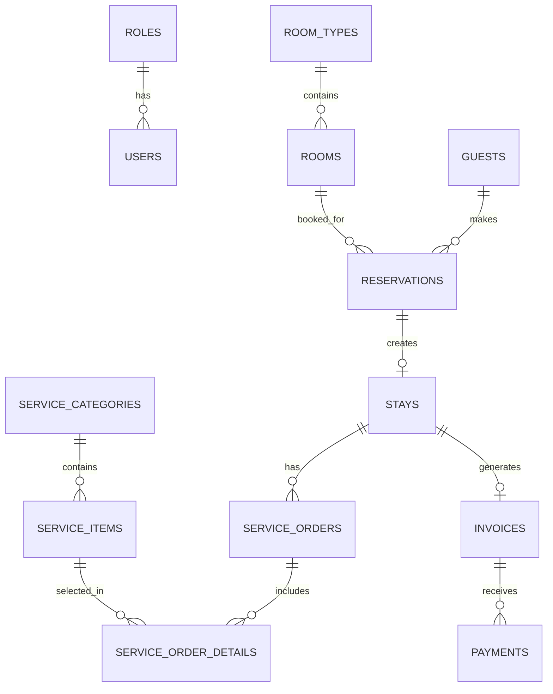

# Mô tả quan hệ ERD - HSMS

13 bảng theo Report 2 §4.4. Mọi FK đều `DeleteBehavior.Restrict` — xóa nghiệp vụ dùng cờ `IsActive`/status, không xóa vật lý.

## Sơ đồ quan hệ (Mermaid)

## Giải thích từng quan hệ

| Quan hệ | Loại | Ý nghĩa nghiệp vụ |
|---|---|---|
| Role 1-N User | 1-N | Mỗi nhân viên thuộc đúng 1 role (Admin/Manager/Receptionist/ServiceStaff) |
| RoomType 1-N Room | 1-N | Loại phòng quyết định giá gốc (`BasePrice`) và sức chứa |
| Guest 1-N Reservation | 1-N | Một khách đặt được nhiều lần |
| Room 1-N Reservation | 1-N | BR03 chặn 2 reservation trùng khoảng ngày trên cùng phòng (index hỗ trợ: RoomId + CheckInDate + CheckOutDate) |
| Reservation 1-0..1 Stay | 1-1 | Check-in biến reservation thành stay. `Stays.ReservationId` UNIQUE — 1 booking chỉ check-in 1 lần (BR04) |
| Stay 1-N ServiceOrder | 1-N | BR06: chỉ stay đang Active mới thêm được order |
| ServiceCategory 1-N ServiceItem | 1-N | Restaurant / Laundry |
| ServiceOrder 1-N Detail N-1 ServiceItem | N-N qua bảng nối | Detail giữ `UnitPrice` tại thời điểm đặt (giá item đổi sau này không ảnh hưởng hóa đơn cũ) |
| Stay 1-0..1 Invoice | 1-1 | Check-out sinh hóa đơn. `Invoices.StayId` UNIQUE — 1 stay 1 hóa đơn (BR07) |
| Invoice 1-N Payment | 1-N | Cho phép thanh toán nhiều lần; tổng payment không vượt TotalAmount (BR08) |

## Ràng buộc mức DB (đã có trong migration InitialCreate, đã test live)

- UNIQUE: `Users.Email`, `Roles.RoleName`, `RoomTypes.TypeName`, `Rooms.RoomNumber` (BR01), `Reservations.BookingCode`, `ServiceCategories.CategoryName`, `Stays.ReservationId`, `Invoices.StayId`
- CHECK: `CK_Reservations_DateRange` (CheckOutDate > CheckInDate - BR02), `CK_ServiceOrderDetails_Quantity` (> 0), `CK_Payments_Amount` (> 0)
- Enum lưu dạng chuỗi (`HasConversion<string>`) để dữ liệu đọc được trực tiếp trong SSMS khi demo
